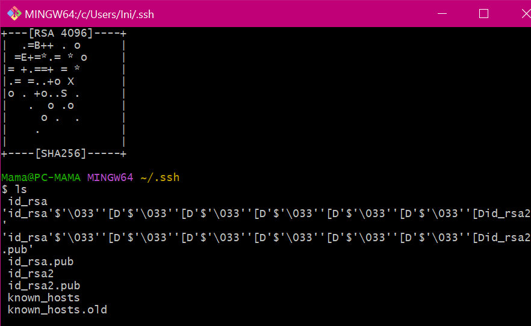
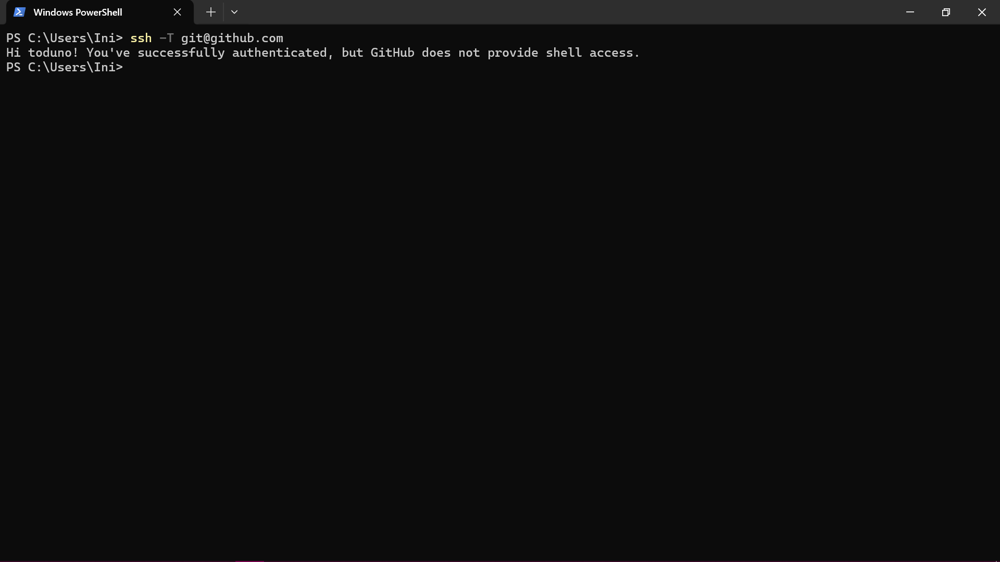

## SYSTEM INSTALLATION LAB GUIDE

### ESSENTIAL TOOLS FOR SEAMLESS INTEGRATION: 
- SSH (Secure Shell)
- SSH-Agent
- Markdown Format
- Visual Studio Code (VSCode)

(Prerequisites: Windows OS, Command Prompt, GitHub Account)

### 1. OPENSSH (AND SSH-AGENT) INSTALLATION AND KEY PAIR SETUP

#### Install SSH/OpenSSH (Windows)
Run the command in terminal to verify openSSH is installed: `ssh`

#### Generate SSH Key Pairs For Secure Authentication
Generate ssh key pair: `ssh-keygen -t rsa -b 4096 -C “myemail”`

From the above, I already had 1 key pair present created a while back in my ssh folder (id_rsa) and a new one was now created (id_rsa2) which makes it 2 private and public key pairs in my ssh folder : _id_rsa_ and _id_rsa.pub_, _id_rsa2_ and _id_rsa2.pub_

#### Configure SSH For Seamless Integration With Version Control Systems And Remote Servers

Copy the ssh key to add to your version control system (GitHub): `cat ~/.ssh/id_rsa2.pub | clip`

Test the ssh connection: `ssh -T git@github.com`

### 2. UNDERSTANDING MARKDOWN AND USAGE

.png)
.png)

### 3. VISUAL STUDIO CODE (VSCode)

#### Install VScode Extensions

#### VScode Git Integration

